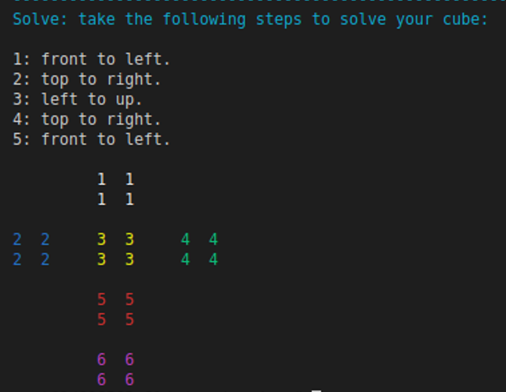

This project includes a Cube class that represents the state of a Rubik's cube, with its methods corresponding to the possible moves the cube can make at each step. Tree search algorithms such as BFS, DFL, and Bidirectional Search are implemented. Each algorithm takes a cube and forms a tree data structure to solve the puzzle. Below is an example of the steps suggested by the algorithm to solve a given cube.

